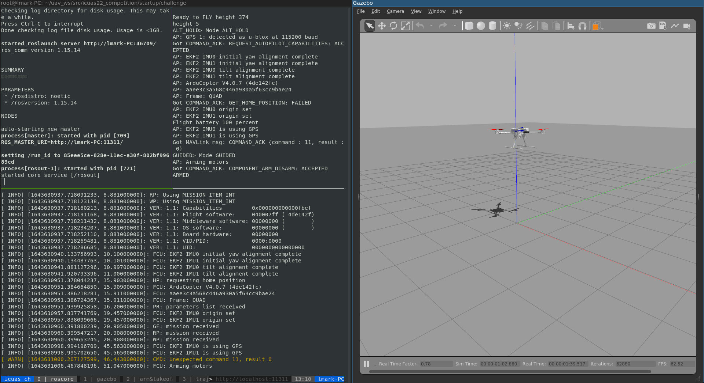

# ICUAS 2022 UAV Competition
The main repository for the ICUAS 2022 UAV competition.

## Install

You can either manually install the UAV software stack by following 
[uav_ros_simulation](https://github.com/larics/uav_ros_simulation) instruction or simply 
use Docker insted.

To install Docker on your system execute the following command:
```
curl https://raw.githubusercontent.com/larics/uav_ros_simulation/main/installation/dependencies/docker.sh | bash
```

## Build

You can either manually build all the packages on your system using the ```catkin build``` command.

Alternatively, to build the ICUAS2022 Competition solution image please execute the following command:
```
./docker_build.sh
```

Additional arguments:
* ```--focal``` - Build Docker image for Focal distro
* ```--bionic``` - Build Docker image for Bionic distra (default)
* ```--build-args``` - Append additional Docker build arguments, e.g. --no-cache

## Startup

To automatically start and setup the challenge navigate to ```startup/challenge``` and run:
```
./start.sh
```
This should automatically setup and start the challenge, as well as run your code.

* Commands that run your challenge solution (rosrun, roslaunch etc.) should be placed in the ```session.yml``` file.
* Software configuration specific to the challenge should be placed in the ```custom_config``` folder.

**NOTE** If you are unfamiliar with the Docker or Tmux commands please check out this [quick-start guide](https://github.com/larics/uav_ros_simulation/blob/main/HOWTO.md).

**NOTE** If you choose to run the challenge inside the docker environment, please run the container first using:
```
./docker_run.sh
```

Additional arguments:
* ```--focal``` - Run Focal distro container
* ```--bionic``` - Run Bionic distro container
* ```--run-args``` - Append additional Docker run arguments, e.g. --rm

**NOTE** Keep in mind this will start a new container so any changes you make inside that container will be lost if you remove the container.
The idea of the container is to easily integrate your code with the challenge flight stack. To do so, please add your code diretcly to this ROS package since it is copied to the container. Furthermore, feel free to edit ```Dockerfile.focal``` or ```Dockerfile.bionic``` files to 
get all the resources and build your solution.

## Simulation

|  | 
|:--:| 
| UAV simulation template startup. Tmux session is running on the left side, with Gazebo client positioned on the right. |

### Topics

* ```tracker/input_pose``` - Generate and execute a trajectory to the given pose
* ```tracker/input_trajectory``` - Generate a trajectory using the given sampled path
* ```position_hold/trajectory``` - Publish a trajectory point directly to the UAV position control

### Configuration

Configuration files are placed in the ```startup/challenge/custom_config``` folder.

* [Position Control](startup/challenge/custom_config/position_control_custom.yaml)
* [TOPP Trajectory Generation](startup/challenge/custom_config/topp_config_custom.yaml)

## Challenge

TODO: Describe challenge 1, add some pictures, etc.